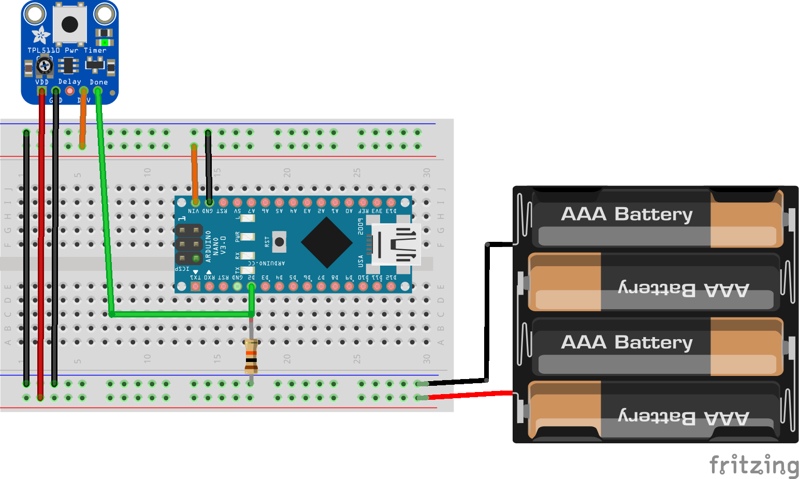
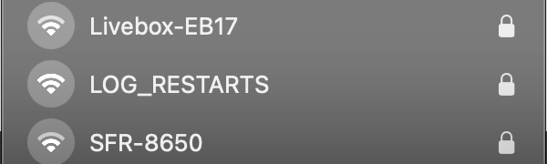
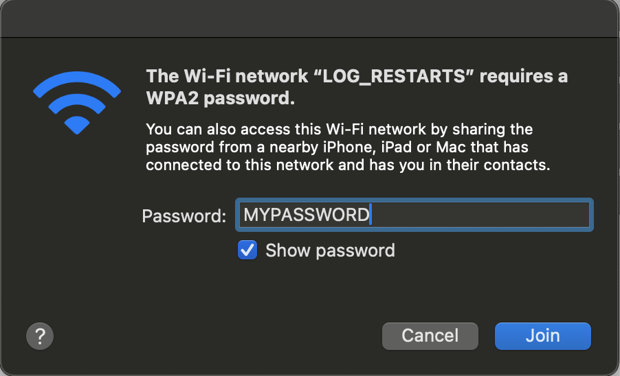
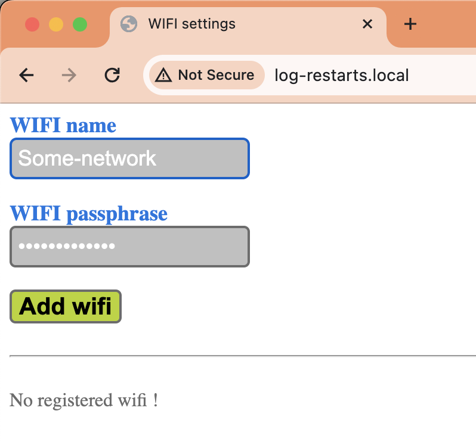
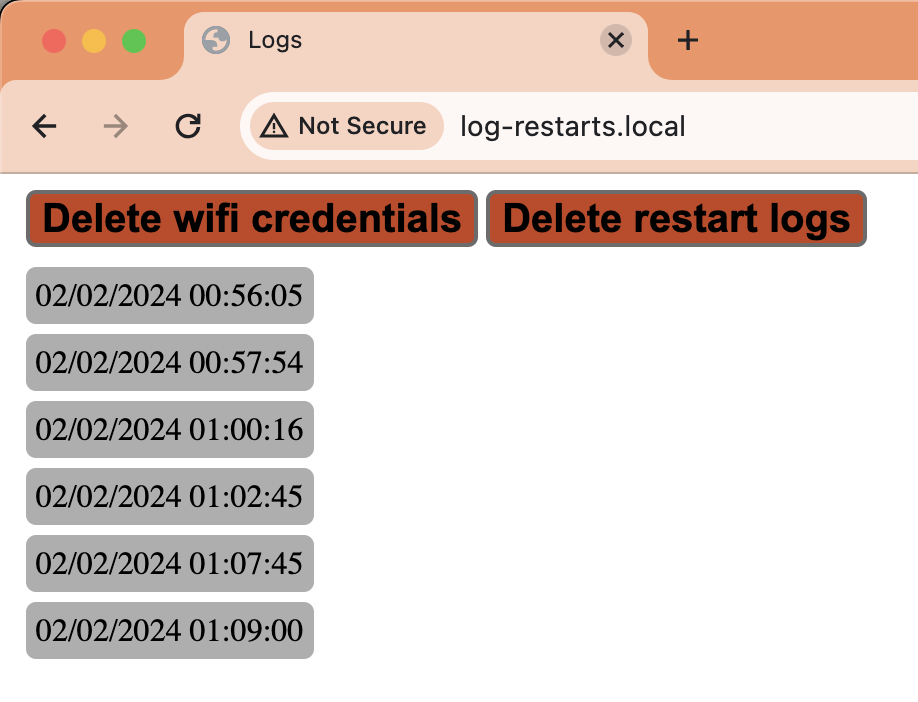

# Log app restarts

Suitable for assessing the hardward delay of the [Adafruit TPL5110 Low Power Timer Breakout](https://www.adafruit.com/product/3435) with an [Arduino Nano ESP32](https://store.arduino.cc/products/nano-esp32) microcontroller.

## First boot

1. Connect the `LOG_RESTARTS` hotspot
   
  
   
2. Entrer the `MYPASSWORD` password
   
  

3. Browse [http://log-restarts.local](http://log-restarts.local)

4. Enter new wifi credentials
   
  

5. Restart the application

## Application

On every reboot, the appliaction:
1. Attempts to connect to the wifi network
2. Syncs time, for the French timezone
3. Appends the startup time to [Preferences](https://www.arduino.cc/reference/en/libraries/preferences/) storage
4. Waits `10 seconds` (you can increase if it's not enought to retrieve the stored data)
5. Sends a `HIGH` to the `D2` pin, connected to the `Done` pin of the `TPL5110`
6. `TPL5110` turns the `Arduino Nano ESP32` off
7. `TPL5110` will wake up the controller after its hardware setting delay has elapsed.

## Website

On the same network, browse [http://log-restarts.local](http://log-restarts.local) to see restart dates
   
  

You can also clear the data stored in the device:
  - `Delete wifi credentials`
  - `Delete restart logs`

## Resources

- [Adaruit Fritzing-Library](https://github.com/adafruit/Fritzing-Library)
- [Ultra low-power sleep with @TXInstruments TPL5110](https://www.youtube.com/watch?v=-cRiN8sxQ5k)
- [Help with using Adafruit TPL5110 Low Power Timer Breakout?](https://forums.adafruit.com/viewtopic.php?t=201491)

